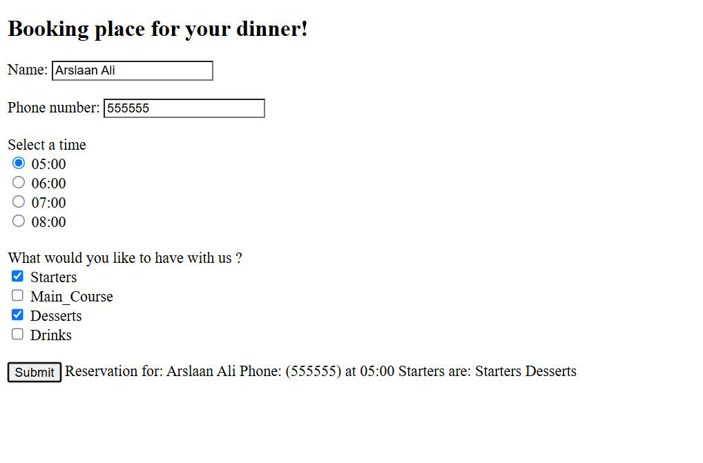
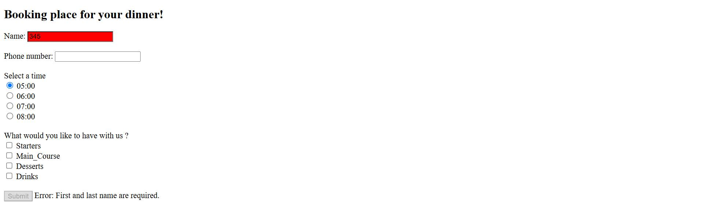
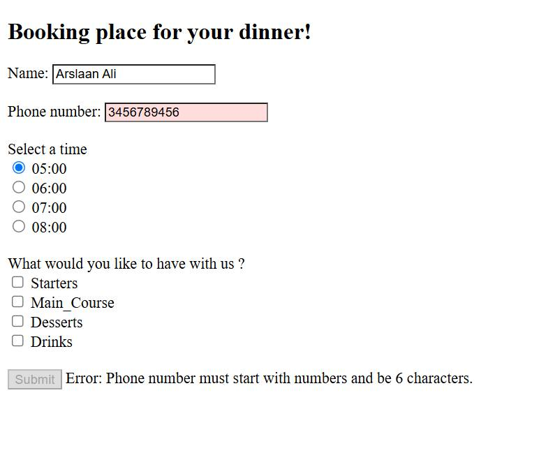
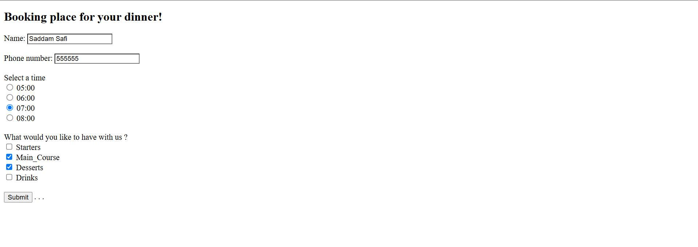
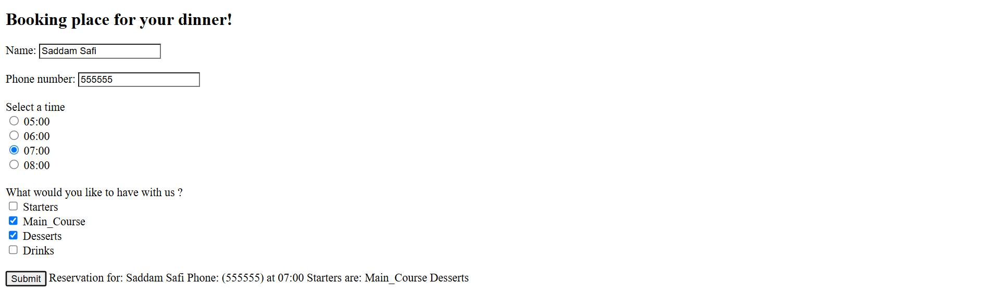

# Dinner Booking Form

This is a simple web-based dinner booking form built using HTML, CSS, and JavaScript. The form allows users to enter their name and phone number, choose a dinner time, and select menu preferences like Starters, Main Course, Desserts, and Drinks.

## Features
- Input validation for Name and Phone Number
- Radio buttons for selecting booking time
- Checkboxes for food options
- Dynamic feedback on errors with red input fields and helpful messages
- Disabled submit button until all required fields are valid
- Displays a confirmation message after successful submission

## Changes & Improvements
- Added real-time form validation logic for:
  - Name: Requires at least first and last name (e.g., "John Smith")
  - Phone Number: Exactly 6 digits
- Used color feedback (red for errors, white for valid fields)
- Submit button remains disabled until both fields are valid
- Displayed reservation details dynamically at the bottom
- Simplified and cleaned up the UI for better user experience

## Help & References
I referred to the following guide from GeeksforGeeks for understanding the basics of form submission and validation:  
[Implementing a Webpage to Book Seat for Restaurant](https://www.geeksforgeeks.org/implementing-a-webpage-to-book-seat-for-restaurant/)

## Screenshots

### 1. Normal Screen

### 2. Name Error

### 3. Phone Number Error

### 4. All fields working

### 4. Booking Confirmed

